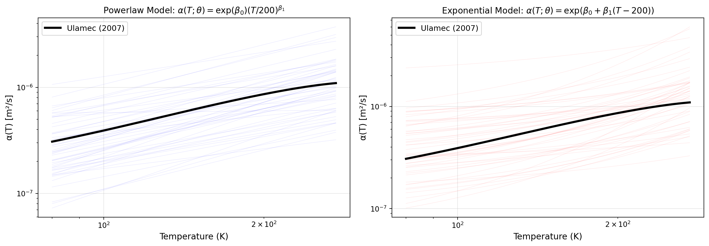

# Theory: Cryobot Digital Twin Framework

## 1. Artificial Data Generation

### 1.1 The Forward Problem

The thermal diffusivity formulation for transient heat conduction in a cylindrical geometry (cryobot borehole) is solved:

$$\frac{\partial T}{\partial t} = \frac{1}{r}\frac{\partial}{\partial r}\left(\alpha(T) \, r \frac{\partial T}{\partial r}\right)$$

with:
- Spatial domain: $r \in [R_o, R_\infty]$ (inner to outer radius)
- Time domain: $t \in [0, L/W]$ (penetration time)
- Boundary conditions: $T(R_o, t) = T_s$ (constant surface), $T(R_\infty, t) = T_\infty$ (ambient far-field)
- Heat flux at inner boundary: $q(t) = -\alpha(T) \left.\frac{\partial T}{\partial r}\right|_{r=R_o}$

The problem is solved using the Finite Element Method (FEniCSx/dolfinx) with implicit time stepping. The melting power is then computed:

$$Q_{lc} = 2\pi R_o W \int_0^{L/W} q(t) \, dt$$

where $W$ is the penetration velocity and $L$ is the borehole length.

### 1.2 Material Model: Ulamec (2007)

The "real" synthetic truth data is generated using the Ulamec (2007) correlations for ice:

$$\alpha(T) = \frac{k(T)}{\rho(T) \, c_p(T)}$$

where:
- **Density** (kg/m³): $\rho(T) = 933.31 + 0.037978 \, T - 3.6274 \times 10^{-4} \, T^2$
- **Thermal conductivity** (W/(m·K)): $k(T) = \frac{619.2}{T} + \frac{58646}{T^3} + 3.237 \times 10^{-3} \, T - 1.382 \times 10^{-5} \, T^2$
- **Heat capacity** (J/(kg·K)): $c_p(T) = \frac{x^3 c_1 + c_2 x^2 + c_3 x^6}{1 + c_4 x^2 + c_5 x^4 + c_6 x^8}$, $x = T/273.16$

### 1.3 Parameterized Models

Two simplified toy models are proposed to approximate the thermal diffusivity:

**Powerlaw model:**
$$\alpha(T; \theta) = \exp(\beta_0) \left(\frac{T}{T_0}\right)^{\beta_1}$$

**Exponential model:**
$$\alpha(T; \theta) = \exp(\beta_0 + \beta_1(T - T_0))$$

where $\theta = (\beta_0, \beta_1)$ are calibration parameters and $T_0 = 200$ K is a reference temperature. The prior parameter ranges are intentionally broad to represent maximum pre-data uncertainty without assuming knowledge of the true material properties:
- Powerlaw: $\beta_0 \in [-20, -10]$ (exp($\beta_0$) $\in$ [2e-9, 4.5e-5] m²/s), $\beta_1 \in [-1, 1]$
- Exponential: $\beta_0 \in [-20, -10]$, $\beta_1 \in [-0.1, 0.1]$

**Figure:** The figure below shows 50 random samples from the prior distributions of both toy models, overlaid with the Ulamec reference alpha(T). Generate it with:
```bash
python scripts/generate_theory_plots.py
```



---

## 2. Gaussian Process Emulator

### 2.1 Training Data Generation

A training set is constructed by evaluating the forward model on a Design of Experiments (DoE) grid:

- **Input space**: $(W, T_s, \beta_0, \beta_1) \in \mathcal{D}$
  - $(W, T_s)$ sampled from artificial data (with optional subsetting)
  - $(\beta_0, \beta_1)$ sampled uniformly using Latin Hypercube Sampling (LHS)
  
- **Output**: $Q_{lc}$ (kW) from solving the PDE for each design point

Default configuration:
- $n_{\text{design}} = 64$ spatial points (subsampled from full dataset)
- $n_\theta = 40$ parameter samples (LHS)
- Total training points: $64 \times 40 = 2560$

### 2.2 GP Kernel and Fitting

The Gaussian Process uses a composite kernel:

$$K = \sigma_\ell^2 \cdot \text{Matérn}(\nu=2.5, \ell_i) + \sigma_{\text{white}}^2$$

**Why Matérn (ν=2.5)?**
- **Smoothness control**: ν=2.5 corresponds to twice-differentiable functions, appropriate for thermal physics where temperatures and heat fluxes should vary smoothly
- **Better generalization**: RBF kernels (ν=∞) assume infinite smoothness, often overfitting; Matérn is more realistic for real data with measurement error
- **Per-dimension length scales**: Each input (W, T_s, β₀, β₁) gets its own length scale, allowing the model to learn that some inputs matter more than others

**Why White Kernel (noise)?**
- **Model discrepancy**: The GP surrogate is an approximation to expensive PDE solves; White noise captures this systematic error
- **Numerical stability**: Small noise prevents ill-conditioning when fitting; variance goes from near-zero to ~1e-5 as learned
- **Realistic uncertainty**: Real observations have sensor noise (~0.1 kW); GP noise term absorbs both measurement and model error

**Why combine them?**
The composite kernel Matérn + White is standard in surrogate modeling because:
1. Matérn captures the smooth underlying physics
2. White noise prevents overfitting and numerical issues
3. The hyperparameters (amplitudes, length scales, noise) are learned from data via maximum likelihood

The GP is trained on standardized input features ($X_s$) and standardized output targets ($y_s$) using maximum likelihood estimation with $n_{\text{restarts}} = 3$ random initializations of hyperparameters.

### 2.3 Prediction

For a new point $(W, T_s, \beta_0, \beta_1)$, the GP provides:
$$Q_\text{pred} \sim \mathcal{N}(\mu(x), \sigma^2(x))$$

where $\mu(x)$ is the posterior mean and $\sigma(x)$ is the posterior standard deviation, accounting for both model discrepancy and parametric uncertainty.

---

## 3. Bayesian Calibration

### 3.1 Problem Setup

Given synthetic observations $\{(W_i, T_{s,i}, y_i)\}$ with measurement noise $\sigma_{\text{meas}}$, infer the posterior distribution of parameters $\theta = (\beta_0, \beta_1)$ for a given toy model.

### 3.2 Prior Distribution

Gaussian priors centered at $(\beta_0, \beta_1) = (-9, 0)$:

**Powerlaw model:**
$$p(\theta) = \mathcal{N}(\beta_0; -9, 2^2) \times \mathcal{N}(\beta_1; 0, 2^2)$$

**Exponential model:**
$$p(\theta) = \mathcal{N}(\beta_0; -9, 2^2) \times \mathcal{N}(\beta_1; 0, 0.015^2)$$

The priors are truncated to their respective parameter bounds (see §1.3).

### 3.3 Likelihood

The likelihood combines GP prediction uncertainty and measurement noise:

$$p(y_i | W_i, T_{s,i}, \theta) = \mathcal{N}\left(y_i; \mu(W_i, T_{s,i}, \theta), \sigma_\text{total}^2\right)$$

where:
$$\sigma_\text{total}^2 = \sigma_\text{meas}^2 + \sigma_{\text{GP}}^2(W_i, T_{s,i}, \theta)$$

### 3.4 MCMC Sampling

The posterior is explored using the Affine Invariant Ensemble MCMC sampler (`emcee`):

- **Walkers**: $n_{\text{walkers}} = 32$ (default)
- **Iterations**: $n_{\text{steps}} = 6000$ (default)
- **Burn-in**: 1500 iterations discarded
- **Thinning**: every 10th sample retained

Initial positions are drawn from:
$$p_0 = \theta_{\text{init}} + \mathcal{N}(0, \Sigma_{\text{init}})$$

where $\theta_{\text{init}} = (-9, 0)$ and $\Sigma_{\text{init}}$ is model-dependent (tighter for exponential).

---

## 4. Uncertainty Quantification

### 4.1 Posterior Predictive Distribution

For any $(W, T_s)$, the posterior distribution of $Q_{lc}$ is approximated by:

1. Sample $n_{\text{post}} = 400$ parameter vectors from the MCMC chain
2. For each $\theta^{(j)}$, evaluate the GP: $\mu_j = \mu(W, T_s, \theta^{(j)})$, $\sigma_j = \sigma_{\text{GP}}(W, T_s, \theta^{(j)})$
3. Draw samples: $Q_j^{(k)} \sim \mathcal{N}(\mu_j, \sigma_j^2)$
4. Aggregate credible intervals: $[Q_{2.5\%}, Q_{\text{median}}, Q_{97.5\%}]$

### 4.2 Posterior Alpha Distribution

Similarly, the posterior distribution of the thermal diffusivity function $\alpha(T; \theta)$ is:

$$\alpha^{(j)}(T) = \begin{cases}
\exp(\beta_0^{(j)}) (T / 200)^{\beta_1^{(j)}} & \text{(powerlaw)} \\
\exp(\beta_0^{(j)} + \beta_1^{(j)}(T - 200)) & \text{(exponential)}
\end{cases}$$

Credible bands are computed element-wise over the posterior samples.

---

## References

- **Ulamec, S.** (2007). Thermal properties and processes in planetary ices. In *Europa* (pp. 427–457). University of Arizona Press.
- **Rasmussen, C. E., & Williams, C. K. I.** (2006). *Gaussian Processes for Machine Learning*. MIT Press.
- **Foreman-Mackey, D., et al.** (2013). *emcee*: The MCMC Hammer. *PASP*, 125(925), 306–312.
